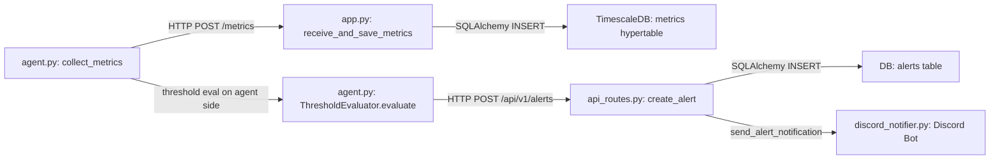

# SysSight — Interview Prep: Full Code Audit

> **Role**: Associate Software Engineer @ SolarWinds  
> **Date**: Tomorrow morning  
> **Approach**: Everything below is sourced from your actual code, not assumptions. Line numbers are cited.

---

## 1. End-to-End Data Path Trace



### Stage 1: Metric Collection (Agent)

| What | Where |
|---|---|
| Entry point | [agent.py:354 `run()`](file:///home/abhijith/coding/syssight/agent/agent.py#L354) |
| Collection | [agent.py:309 `collect_metrics()`](file:///home/abhijith/coding/syssight/agent/agent.py#L309) |
| Individual collectors | [agent.py:14-75](file:///home/abhijith/coding/syssight/agent/agent.py#L14-L75) — `get_cpu_percent()`, `get_memory_info()`, `get_disk_info()`, `get_network_io()`, `get_load_average()` |

The `run()` loop (line 369) calls `collect_metrics()` each cycle. Each metric function wraps a `psutil` call. `get_cpu_percent()` calls `psutil.cpu_percent(interval=1)` — this **blocks for 1 second** to measure CPU, which means every 10-second cycle actually takes ~11 seconds minimum.

### Stage 2: Transport (Agent → Server)

| What | Where |
|---|---|
| HTTP POST | [agent.py:387-391](file:///home/abhijith/coding/syssight/agent/agent.py#L387-L391) |
| Auth header | [agent.py:157-161](file:///home/abhijith/coding/syssight/agent/agent.py#L157-L161) |
| Payload | JSON, built at [agent.py:323-327](file:///home/abhijith/coding/syssight/agent/agent.py#L323-L327) |

```python
response = self.session.post(
    self.server_url,        # default: http://127.0.0.1:8000/metrics
    data=json.dumps(metrics_payload),
    timeout=5
)
```

The `requests.Session` carries a `Bearer` token in the `Authorization` header (line 158-160). Payload is a flat JSON object with nested sub-objects for memory, disk, network, and load_average.

### Stage 3: Server Ingestion

| What | Where |
|---|---|
| Endpoint | [app.py:140 `POST /metrics`](file:///home/abhijith/coding/syssight/server/app.py#L140) |
| Auth check | [app.py:134-137 `verify_token()`](file:///home/abhijith/coding/syssight/server/app.py#L134-L137) |
| Validation | Via Pydantic `MetricPayload` ([pydantic_models.py:30-43](file:///home/abhijith/coding/syssight/server/pydantic_models.py#L30-L43)) |
| ORM Insert | [app.py:146-163](file:///home/abhijith/coding/syssight/server/app.py#L146-L163) |

Server flattens the nested payload into a single `Metric` ORM object and does `db.add()` + `await db.commit()`. **One INSERT per metric per host per cycle.**

### Stage 4: Storage (TimescaleDB)

| What | Where |
|---|---|
| Table def | [models.py:4-22 `class Metric`](file:///home/abhijith/coding/syssight/server/models.py#L4-L22) |
| Hypertable creation | [app.py:90](file:///home/abhijith/coding/syssight/server/app.py#L90) |
| Composite PK | [app.py:56-87](file:///home/abhijith/coding/syssight/server/app.py#L56-L87) |

```sql
SELECT create_hypertable('metrics', 'timestamp', if_not_exists => TRUE);
```

Primary key is `(timestamp, id)` — the startup code dynamically alters the PK to include `timestamp` because TimescaleDB requires the partition column in the PK.

### Stage 5: Alert Evaluation (Agent-Side)

| What | Where |
|---|---|
| Threshold check | [agent.py:82-108 `ThresholdEvaluator.evaluate()`](file:///home/abhijith/coding/syssight/agent/agent.py#L82-L108) |
| Flat metrics build | [agent.py:339-344](file:///home/abhijith/coding/syssight/agent/agent.py#L339-L344) |
| Alert POST | [agent.py:283-307 `send_alert()`](file:///home/abhijith/coding/syssight/agent/agent.py#L283-L307) |

After collecting metrics, the agent flattens them into `flat_metrics` and runs `evaluate()`. Violations are POSTed to `/api/v1/alerts`.

### Stage 6: Alert Persistence + Notification (Server-Side)

| What | Where |
|---|---|
| Alert endpoint | [api_routes.py:316-365 `create_alert()`](file:///home/abhijith/coding/syssight/server/api_routes.py#L316-L365) |
| Dedup check | [api_routes.py:322-331](file:///home/abhijith/coding/syssight/server/api_routes.py#L322-L331) |
| Discord notify | [api_routes.py:354-363](file:///home/abhijith/coding/syssight/server/api_routes.py#L354-L363) |
| Discord bot | [discord_notifier.py](file:///home/abhijith/coding/syssight/server/discord_notifier.py) |

The server checks for an existing `active` alert with the same `hostname + metric_name`. If one exists, it just updates the timestamp (no new Discord notification). If not, it creates a new alert and fires a Discord embed via `send_alert_notification()`.

---

## 2. Deep Dive: What Your Code ACTUALLY Does

### Push or Pull?

**Push.** The agent POSTs to the server. This is explicit:

```python
# agent.py:387-391
response = self.session.post(
    self.server_url,
    data=json.dumps(metrics_payload),
    timeout=5
)
```

- **Protocol**: HTTP/1.1 (Python `requests` library, not async)
- **Payload format**: JSON
- **Interval**: 10 seconds default (`SYSSIGHT_INTERVAL` env var, [agent.py:135](file:///home/abhijith/coding/syssight/agent/agent.py#L135))
- **Effective interval**: ~11+ seconds because `psutil.cpu_percent(interval=1)` blocks for 1 second ([agent.py:15](file:///home/abhijith/coding/syssight/agent/agent.py#L15)), and the `sleep_duration` calculation at [line 409](file:///home/abhijith/coding/syssight/agent/agent.py#L409) subtracts elapsed time but the floor is 0, not negative.

> **Interview script**: "I chose push over pull because it keeps the server stateless — it doesn't need to know agent addresses upfront or maintain connection state. In production, I'd want to add pull-based scraping (like Prometheus) as an option, since pull makes it easier to detect dead agents — a missing scrape target is immediately visible."

---

### What Happens If the Server Is Down?

**Metrics are dropped.** There is **no buffering, no retry, no queue, no backpressure**.

```python
# agent.py:396-405
except requests.exceptions.HTTPError as e:
    print(f"Error: HTTP Error {e.response.status_code}...", file=sys.stderr)
except requests.exceptions.RequestException as e:
    print(f"Error: Could not push metrics...", file=sys.stderr)
```

The exceptions are caught, logged to stderr, and the loop continues to the next interval. Data from that cycle is gone.

> **Interview script**: "Currently, if the server is unreachable, metrics are silently dropped. In production I'd add a local ring buffer (say, 100 samples in memory, or a WAL file on disk) and exponential backoff retry. Tools like Prometheus remote-write or the OpenTelemetry Collector solve this with configurable retry queues and persistent on-disk buffering."

---

### Authentication / Identity

**Auth**: Static bearer token, shared by all agents.

```python
# agent.py:136
self.auth_token = os.getenv("SYSSIGHT_AUTH_TOKEN", "your_secret_auth_token")

# agent.py:158-160
self.session.headers.update({
    "Content-Type": "application/json",
    "Authorization": f"Bearer {self.auth_token}"
})
```

```python
# app.py:134-137
async def verify_token(authorization: str = Header(...)):
    expected_token = os.getenv("SYSSIGHT_AUTH_TOKEN", "your_secret_auth_token")
    if authorization != f"Bearer {expected_token}":
        raise HTTPException(status_code=status.HTTP_401_UNAUTHORIZED, ...)
```

> [!WARNING]
> The default token is literally `"your_secret_auth_token"` hardcoded as a fallback. If neither side sets the env var, they'll both use this insecure default and it will "work" — a terrible production practice.

**Identity**: Hostname from `socket.gethostname()` ([agent.py:137](file:///home/abhijith/coding/syssight/agent/agent.py#L137)). The server trusts whatever the agent sends in the `hostname` JSON field. **There is no per-agent identity, no mTLS, no agent registration token.** Any entity with the shared bearer token can POST metrics as any hostname.

> **Interview script**: "Authentication is a shared bearer token — simple but not production-grade. I'd switch to per-agent API keys or mTLS certificates, and validate the hostname claim against the registered identity. Right now a compromised agent could impersonate another host."

---

### TimescaleDB: Hypertable or Just Postgres?

**It is actually a hypertable.** The startup code at [app.py:90](file:///home/abhijith/coding/syssight/server/app.py#L90) runs:

```sql
SELECT create_hypertable('metrics', 'timestamp', if_not_exists => TRUE);
```

However:
- **No custom chunk interval** — you get the default (7 days). For a 10-second collection interval, the TimescaleDB team recommends chunks that hold ~25% of your active queries' time range. 7 days may be too coarse.
- **No compression policy** — no `ALTER TABLE ... SET (timescaledb.compress)` or `add_compression_policy()` anywhere in the code.
- **No retention policy** — no `add_retention_policy()`. The table will grow unbounded.
- **No continuous aggregates** — no `CREATE MATERIALIZED VIEW ... WITH (timescaledb.continuous)`. Historical queries do real-time `AVG()` aggregation at query time.

> **Interview script**: "I'm using TimescaleDB hypertables for automatic time-based partitioning, but I haven't configured compression, retention, or continuous aggregates yet. In production, I'd add compression after 24 hours to get ~10x storage savings, a retention policy to drop data older than 90 days, and continuous aggregates for the dashboard's 1h and 1d step views to avoid scanning raw data."

---

### Indexes

From [models.py](file:///home/abhijith/coding/syssight/server/models.py):

| Column | Index | Query pattern it serves |
|---|---|---|
| `metrics.timestamp` | PK + `index=True` | Hypertable partition key, time-range queries |
| `metrics.id` | PK + `index=True` | Unique row identification |
| `metrics.hostname` | `index=True` | `WHERE hostname = :hostname` in latest/historical queries |
| `alerts.hostname` | `index=True` | Filtering alerts by host |
| `alerts.metric_name` | `index=True` | Dedup check in `create_alert()` |
| `alerts.triggered_at` | `index=True` | `ORDER BY triggered_at DESC` |
| `threshold_configs.hostname` | `index=True` | Looking up per-host thresholds |

> [!NOTE]
> Missing: **compound index on `(hostname, timestamp DESC)`** for the `metrics` table. Your two most common queries — latest metric and historical range — both filter on `hostname` AND sort/filter on `timestamp`. Without a compound index, Postgres must scan the hostname index, then sort by timestamp. TimescaleDB's chunk exclusion helps, but a compound index would be significantly faster.

---

### Alerting: Single Sample or Time Window?

**Single sample.** The `ThresholdEvaluator` at [agent.py:110-130](file:///home/abhijith/coding/syssight/agent/agent.py#L110-L130) compares the **current metric value** against the threshold with a simple operator:

```python
def _check_threshold(self, metrics, threshold):
    metric_value = metrics.get(threshold['metric_name'])
    if metric_value is None:
        return False
    if operator == '>':
        return metric_value > threshold_value
    # ...
```

There is **no time window, no duration condition, no hysteresis**.

**Anti-flap mechanism**: There are two layers, but both are weak:

1. **Agent-side**: 10-second cooldown per `alert_key` ([agent.py:90-94](file:///home/abhijith/coding/syssight/agent/agent.py#L90-L94)):
   ```python
   if current_time - self.sent_alerts[alert_key] < 10:  # 10 seconds
       continue  # Skip this alert
   ```
   With a 10-second collection interval, this effectively fires at most once per cycle — so it barely throttles at all.

2. **Server-side**: Dedup by `hostname + metric_name + status='active'` ([api_routes.py:322-337](file:///home/abhijith/coding/syssight/server/api_routes.py#L322-L337)). If an active alert already exists, it updates the timestamp instead of creating a new one. **This is actually the real guard** — it prevents duplicate Discord notifications for the same ongoing violation.

> [!WARNING]
> **No auto-resolution.** Once an alert fires, it stays `active` until someone manually resolves it via `PATCH /api/v1/alerts/{id}/resolve`. If CPU spikes to 95% for 1 second and then drops to 5%, the alert stays active forever. There's no check that says "the metric is now below the threshold, auto-resolve."

> **Interview script**: "My alerting evaluates single samples — if CPU crosses 80% for even one reading, it fires. In production this causes false positives from transient spikes. I'd add a duration condition — 'fire only if the threshold is violated for N consecutive samples or T minutes' — and auto-resolution when the metric returns below threshold. Tools like Prometheus Alertmanager use a `for` duration clause for exactly this reason."

---

### Agent CPU/Memory Overhead

**Your code does not measure or report its own resource consumption.** There is no self-monitoring.

However, the `psutil` calls are lightweight. The heaviest part is `psutil.cpu_percent(interval=1)` which blocks for 1 second. The `get_process_list()` iterates all processes but is only called on-demand via the Flask endpoint, not every cycle.

Estimated overhead per cycle:
- `psutil.cpu_percent(interval=1)`: ~1 second wall time, negligible CPU
- `psutil.virtual_memory()`, `psutil.disk_usage()`, `psutil.net_io_counters()`, `psutil.getloadavg()`: microseconds each
- `requests.post()`: ~5-50ms depending on network
- JSON serialization: negligible
- Flask server thread: idle most of the time, ~2-5MB memory overhead

**Rough estimate**: <1% CPU, ~30-50MB RSS (Python interpreter + psutil + requests + Flask).

> **Interview script**: "The agent is lightweight — psutil calls are fast kernel reads. The main cost is the Python runtime itself at ~30-50MB RSS. If I were targeting embedded or edge devices, I'd rewrite the agent in Go or Rust to bring that down to ~5-10MB."

---

### Batching

**No batching.** Every host sends one HTTP POST per cycle, and the server does one `db.add()` + `db.commit()` per POST — **one INSERT per metric per host per cycle.**

```python
# app.py:161-162
db.add(new_metric)
await db.commit()
```

There is no bulk insert, no write buffer, no batch flush.

> **Interview script**: "Currently each agent POST is one database INSERT. This works fine at small scale but becomes a bottleneck past ~100 agents because each INSERT is a separate transaction with fsync. I'd batch inserts on the server side — buffer incoming metrics in memory and flush every second with a multi-row INSERT or COPY command. TimescaleDB recommends batches of 1000+ rows for optimal insert throughput."

---

## 3. Rough Numbers You Can Quote

| Metric | Value | Source |
|---|---|---|
| Collection interval | 10 seconds (configurable via env) | [agent.py:135](file:///home/abhijith/coding/syssight/agent/agent.py#L135) |
| Effective interval | ~11s (1s `cpu_percent` block) | [agent.py:15](file:///home/abhijith/coding/syssight/agent/agent.py#L15) |
| Rows per agent per minute | ~5.5 | 60/11 ≈ 5.5 |
| 10 agents → rows/sec | ~0.55 | 10 × 5.5 / 60 |
| 100 agents → rows/sec | ~5.5 | 100 × 5.5 / 60 |
| 1000 agents → rows/sec | ~55 | 1000 × 5.5 / 60 |
| Payload size per POST | ~500-700 bytes JSON | Hostname + 8 metric fields |
| Row size in DB | ~100-120 bytes | 3 floats + 2 bigints + 3 floats + strings + timestamp |
| Daily storage per agent | ~47K rows ≈ 5-6 MB (uncompressed) | 86400/11 × 120 bytes |
| Daily storage for 100 agents | ~500-600 MB uncompressed | |

### Where It Breaks

| Bottleneck | Limit | Why |
|---|---|---|
| **Single-threaded inserts** | ~100-200 agents | One INSERT per POST, one transaction per insert. Postgres can handle ~1000 simple INSERTs/sec, but with the ORM overhead and async context switching, expect ~200-500/sec. |
| **No connection pooling** | ~50-100 concurrent | SQLAlchemy `create_async_engine` defaults to `pool_size=5`. If 50+ agents POST simultaneously, connections queue up. |
| **In-memory agent registry** | Server restart | [agent_registry.py](file:///home/abhijith/coding/syssight/server/agent_registry.py#L5) is a plain `dict`. Restart = empty registry = process viewer breaks until agents re-register (up to 5 min). |
| **Unbounded storage** | Weeks/months | No retention policy. At 100 agents, ~18 GB/month. |
| **Synchronous `requests.get()` in async handler** | ~20-50 concurrent process queries | [api_routes.py:281](file:///home/abhijith/coding/syssight/server/api_routes.py#L281) uses blocking `requests.get()` inside an async FastAPI handler, which blocks the event loop thread. |

---

## 4. Top 10 Hardest Questions (Ranked by Weakness Exposure)

### #1: "What happens when a metric is flapping around the threshold — CPU bouncing between 79% and 81%?"

**Honest answer**: On the agent side, the 10-second cooldown is effectively useless since collection is every ~11 seconds. However, the server-side dedup ([api_routes.py:322-331](file:///home/abhijith/coding/syssight/server/api_routes.py#L322-L337)) prevents duplicate Discord notifications — once an `active` alert exists for that hostname+metric, subsequent violations just update the timestamp. So you get **one Discord alert, not hundreds**. But there's no auto-resolution, so the alert stays active even when the metric drops back down.

**What I'd do differently**: "I'd add a `for` duration (fire only after N consecutive violations) and auto-resolution with a separate recovery threshold (hysteresis) — e.g., fire at 80%, recover at 75%."

---

### #2: "You're using `requests.get()` (synchronous, blocking) inside an async FastAPI handler for the process endpoint. What does that do to your server?"

**Honest answer**: At [api_routes.py:281](file:///home/abhijith/coding/syssight/server/api_routes.py#L281), `requests.get()` blocks the event loop thread. FastAPI/Starlette runs async handlers on the main event loop. A blocking call there stalls **all other requests** until the agent responds (up to the 10-second timeout). With multiple concurrent process queries, the server effectively becomes single-threaded.

**What I'd do differently**: "I'd replace `requests.get()` with `httpx.AsyncClient.get()` or run the blocking call in a thread pool with `asyncio.to_thread()`. This is a straightforward fix."

---

### #3: "You have no retention policy, no compression, no continuous aggregates. How would you query 30 days of data for 100 hosts?"

**Honest answer**: Right now it would be a raw `AVG()` over the entire time range, scanning millions of rows. The `time_bucket` function at [api_routes.py:164](file:///home/abhijith/coding/syssight/server/api_routes.py#L164) helps aggregate, but it's still scanning raw data.

**What I'd do differently**: "I'd define continuous aggregates for 1-minute, 5-minute, and 1-hour rollups. Queries against the dashboard would hit the aggregate, not the raw table. I'd also enable native TimescaleDB compression after 24 hours (typically 10x savings) and a 90-day retention policy on raw data."

---

### #4: "How does the server know which host a metric came from — and can I spoof it?"

**Honest answer**: The agent self-reports its `hostname` in the JSON payload ([agent.py:324](file:///home/abhijith/coding/syssight/agent/agent.py#L324)). The server trusts it. The auth token is shared across all agents. **Yes, any agent with the token can claim to be any hostname.** There is no server-side validation that the reported hostname matches the source IP or any registered identity.

**What I'd do differently**: "Per-agent API keys tied to a registered hostname, or mTLS with the CN field in the certificate matching the expected hostname."

---

### #5: "Your agent registry is an in-memory Python dict. What happens when your server process restarts?"

**Honest answer**: The registry empties ([agent_registry.py:5](file:///home/abhijith/coding/syssight/server/agent_registry.py#L5)). The process viewer endpoint returns 404 for all hosts. Agents re-register every 5 minutes ([agent.py:208](file:///home/abhijith/coding/syssight/agent/agent.py#L208)), so there's a window of up to 5 minutes where process data is unavailable.

**What I'd do differently**: "Store agent registrations in the database with a `last_seen` heartbeat column, or use a service discovery tool like Consul. The re-registration interval handles eventual recovery, but the gap is a problem."

---

### #6: "You run alert evaluation on the agent, not the server. Why? What are the tradeoffs?"

**Honest answer**: I evaluate thresholds in `collect_metrics()` at [agent.py:337-350](file:///home/abhijith/coding/syssight/agent/agent.py#L337-L350). The agent fetches thresholds from the server every 20 seconds ([agent.py:241-281](file:///home/abhijith/coding/syssight/agent/agent.py#L241-L281)).

Pros: Reduces server load, alerts still fire if server is intermittently reachable. Cons: Agent doesn't have historical data, so it can't do time-window or cross-host alerting. Also, if the agent process crashes, alerting stops for that host — the server has no way to know.

**What I'd do differently**: "For single-host threshold checks, agent-side evaluation is fine and faster. But for complex rules — 'fire if 3 out of 5 hosts have CPU > 90%' — I'd need server-side evaluation with a dedicated alert evaluation loop."

---

### #7: "Network I/O — you're storing cumulative counters, not rates. How do you graph network throughput?"

**Honest answer**: `psutil.net_io_counters()` returns cumulative `bytes_sent` and `bytes_recv` since boot ([agent.py:34-39](file:///home/abhijith/coding/syssight/agent/agent.py#L34-L39)). The server stores these as-is in `net_bytes_sent` and `net_bytes_received` ([models.py:18-19](file:///home/abhijith/coding/syssight/server/models.py#L18-L19)). **I never compute the delta.** Graphing cumulative counters directly shows an ever-increasing line, not throughput.

**What I'd do differently**: "Either compute the delta on the agent (current - previous reading) and send bytes/sec, or use a query-time derivative: `(value - LAG(value)) / interval`. TimescaleDB has `derivative()` for this."

---

### #8: "What happens if two agents share the same hostname?"

**Honest answer**: Both agents POST metrics with the same `hostname` string. The server happily stores both — there's no uniqueness constraint on hostname per time period. Queries like `SELECT DISTINCT ON (hostname)` ([api_routes.py:37](file:///home/abhijith/coding/syssight/server/api_routes.py#L37)) will only show the latest one, silently hiding the other. The agent registry will contain whichever registered last (dict overwrite). Alerts would deduplicate (same hostname+metric_name), masking issues on one of the two machines.

**What I'd do differently**: "I'd use a compound identifier — hostname + a machine-id (like `/etc/machine-id` on Linux) — to guarantee uniqueness even in container environments where hostnames can collide."

---

### #9: "You claim this 'runs in Docker' in your description, but I don't see a Dockerfile or docker-compose.yml."

**Honest answer**: The only Docker involvement is the TimescaleDB container started via `docker run` in the README ([README.md:44-45](file:///home/abhijith/coding/syssight/README.md#L44-L45)). The agent, server, and frontend are run as bare processes. There is no Dockerfile, no docker-compose.yml, and no containerization of the application itself.

**What I'd do differently**: "I'd create a `docker-compose.yml` with services for TimescaleDB, the server, and one or more agents, plus proper networking and volume mounts. That would make the system reproducibly deployable."

---

### #10: "Your `POST /agents/register` endpoint has no auth. Can I register a malicious agent?"

**Honest answer**: Looking at the code — [api_routes.py:212-237](file:///home/abhijith/coding/syssight/server/api_routes.py#L212-L237) — the `/agents/register` endpoint does **not** have `dependencies=[Depends(verify_token)]`. Neither do `GET /api/v1/thresholds`, `GET /api/v1/hosts`, `GET /api/v1/alerts`, or any other `/api/v1/*` endpoint. Only `POST /metrics` is authenticated.

Actually wait — the agent does send the auth header on registration ([agent.py:219-222](file:///home/abhijith/coding/syssight/agent/agent.py#L219-L222)) because it uses `self.session` which has the auth header. But the **server doesn't check it** on that route. So yes, anyone can register a fake agent pointing to a malicious IP, and when someone views processes for that host, the server will make a `requests.get()` call to the attacker's server — a potential SSRF vector.

**What I'd do differently**: "Apply the `verify_token` dependency to all mutating API routes, and validate that the registered IP/port belongs to a trusted network range."

---

## 5. Resume Bullet Contradictions

> [!CAUTION]
> Read these carefully. If any of these are on your resume, either fix the bullet or be ready with the honest caveat.

| Potential Resume Claim | Reality in Code | Risk |
|---|---|---|
| **"Runs in Docker"** | Only TimescaleDB runs in a Docker container. No Dockerfile/Compose for the app itself. | If they ask "show me the Dockerfile," you have none. Say "the database is containerized; the app itself isn't containerized yet." |
| **"Event-driven alerting"** | Alerting is polled, not event-driven. The agent checks thresholds synchronously in its collection loop ([agent.py:337-350](file:///home/abhijith/coding/syssight/agent/agent.py#L337-L350)), then POSTs. There's no message queue, no pub/sub, no event bus. | Say "threshold evaluation happens in-line with collection and POSTs alerts via HTTP" — don't call it "event-driven" unless you define event-driven as "fires HTTP on threshold breach." |
| **"User-configurable thresholds"** | This is true — thresholds are stored in DB, served via API, and agents poll every 20s. This one checks out. ✅ | Safe to claim. |
| **"TimescaleDB time-series storage"** | Hypertable exists ✅, but no compression, retention, continuous aggregates, or custom chunk interval. You're using maybe 20% of TimescaleDB's features. | Say "I'm using hypertables for partitioning" — don't claim you've set up a production-grade time-series pipeline. |
| **"Distributed system monitoring"** | Architecturally yes — agents on multiple hosts, central server. But there are no tests, no health checks, no service discovery, no HA. It's a single-server setup. | This is the weakest claim if they probe. Say "distributed collection with a single-server architecture" — be clear there's no server redundancy. |
| **"Discord notifications"** | This is genuine and well-implemented. The bot uses discord.py with proper async handling, embeds with severity colors, and separate notification types for alerts and resolutions. ✅ | Safe to claim. |

---

## Quick Reference: Formal Terms You Should Know

Since you mentioned being shaky on CS terminology, here's a cheat sheet of terms that map to things you already built:

| Term | What it means in your code |
|---|---|
| **Push-based telemetry** | Your agents POST metrics to the server (vs. pull/scrape like Prometheus) |
| **Time-series database** | TimescaleDB — optimized for append-heavy timestamp-indexed data |
| **Hypertable** | TimescaleDB's auto-partitioned table. Chunks = partitions by time range |
| **ORM** | SQLAlchemy — maps Python classes to database tables |
| **Data Transfer Object (DTO)** | Your Pydantic models (`MetricPayload`) — validate + serialize data crossing boundaries |
| **Backpressure** | When a downstream system (DB) is slow and the upstream (agent) needs to slow down too. You don't have this. |
| **Idempotent** | An operation that produces the same result if called multiple times. Your `create_hypertable(..., if_not_exists => TRUE)` is idempotent. |
| **SSRF (Server-Side Request Forgery)** | When your server makes HTTP requests to URLs controlled by user input. Your process viewer does this. |
| **Ring buffer** | Fixed-size FIFO — what you'd use to buffer metrics locally when the server is down. |
| **Continuous aggregate** | Pre-computed materialized view that TimescaleDB keeps updated. You don't use these. |
| **Hysteresis** | Using different thresholds for triggering vs. recovery to prevent flapping. You don't have this. |
| **Cardinality** | Number of unique values in a dimension. Low cardinality = hostname (dozens). High cardinality = PID (thousands). |
| **Write-Ahead Log (WAL)** | Postgres's durability mechanism. Also what you'd use for local agent buffering. |
| **Connection pool** | SQLAlchemy's engine manages a pool of DB connections. Default `pool_size=5`. |

---

> [!TIP]
> **Your strongest talking points** (things you actually did well):
> 1. The Pydantic validation layer — proper input validation with typed models
> 2. Server-side alert deduplication — prevents notification storms
> 3. Configurable thresholds with pull-based sync — agents adapt without restart
> 4. The composite PK migration logic in `on_startup()` — handles the TimescaleDB constraint correctly
> 5. SQL injection prevention via whitelist (`ALLOWED_METRIC_TYPES`)
> 6. The `time_bucket()` usage for historical aggregation — this is the right TimescaleDB function
> 7. Graceful error handling in metric collectors — individual collector failures don't crash the agent

> [!IMPORTANT]
> **Your biggest vulnerabilities** (prepare for these first):
> 1. No retry/buffering when server is down
> 2. Blocking `requests.get()` in async handler
> 3. Single-sample alerting with no duration condition
> 4. No auto-resolution of alerts
> 5. No network rate computation (cumulative counters stored raw)
> 6. Missing auth on most API endpoints
> 7. No Dockerfile despite "runs in Docker" framing

Good luck tomorrow. You built something real and architecturally sound at the core — just be honest about the gaps and show you understand why they matter.
